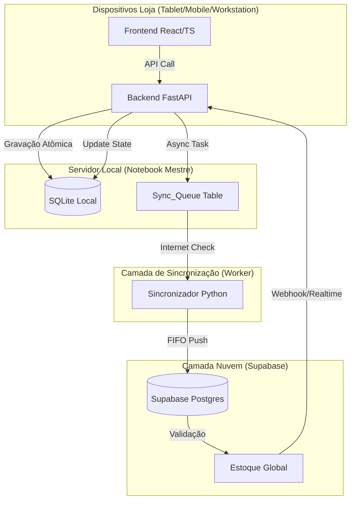

# Arquitetura de Dados - LolliPop (Edge Computing)

Esta arquitetura detalha o fluxo "Local-First" onde o notebook da loja serve como o servidor central.

## 1. Fluxo de Sincronização e Estados

## 2. Estrutura do Banco Local (SQLite)

### Tabela: `inventory`
- `id` (UUID): Identificador único global.
- `sku`: Código do produto (Tamanho/Cor).
- `stock_local`: Quantidade disponível no servidor da loja.
- `last_sync`: Timestamp da última atualização da nuvem.

### Tabela: `sales`
- `id` (UUID): Gerado no frontend ou backend local.
- `customer_id`: ID do cliente.
- `total_price`: Valor da venda.
- `status`: ['reserved', 'synced', 'conflict'].
- `created_at`: Timestamp de alta precisão do notebook.

### Tabela: `sync_queue` (A Mais Importante)
- `id`: Autoincrement.
- `payload`: Conteúdo JSON da transação (venda, alteração de estoque).
- `status`: ['pending', 'processing', 'failed'].
- `attempts`: Número de tentativas de sync.
- `created_at`: Ordem para processamento FIFO.

## 3. Lógica de Sincronização
1. O PDV envia uma venda para o FastAPI.
2. O FastAPI abre uma transação no SQLite:
   - Decrementa `inventory`.
   - Salva em `sales`.
   - Insere o registro em `sync_queue`.
3. Um processo em background (BackgroundTasks do FastAPI) tenta enviar para o Supabase.
4. Se falhar (sem internet), o item permanece como `pending` na `sync_queue`.
5. Um loop de verificação (Health Check) re-tenta o envio assim que a conectividade for detectada.
