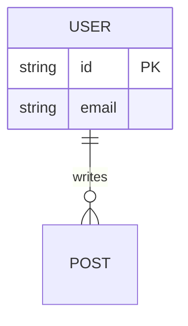

# Planning Templates

These models must be followed to ensure consistency and professional quality.

---

## [TEMPLATE] PRD.md

# Product Requirements Document: [Project Name]

## 1. Overview
- **Problem**: [Clear description of the problem]
- **Goal**: [What we want to achieve]
- **Target Audience**: [Who will use it]

## 2. Functional Requirements
- [FR001]: [Requirement description]
- [FR002]: [Requirement description]

## 3. User Stories
- As a [user type], I want to [action], so that [benefit].

## 4. Scope (In/Out)
- **In**: [What will be done]
- **Out**: [What will NOT be done explicitly]

## 5. Success Metrics
- [KPI 1]: [Ex: Response time < 200ms]

---

## [TEMPLATE] Data_Architecture.md

# Data Architecture

## ER Diagram (Entity Relationship)

## Data Flow
[Explanation of how data enters, is processed, and stored]

---

## [TEMPLATE] Risk_Analysis.md

# Risk Analysis

| Risk | Probability | Impact | Mitigation Plan |
|-------|---------------|---------|--------------------|
| API Failure | Medium | High | Implement Retry-Logic and offline Cache |

---

## [TEMPLATE] Implementation_Log.md

# Implementation Log (Immutable)

> [!IMPORTANT]
> NEVER update previous entries. Only append new information at the end.

---
## [2026-03-08 10:00] - STAGE-01: Initialization
- **Action**: Generating basic document structure.
- **Rationale**: Establish planning foundations before coding.
- **Status**: [OK]
